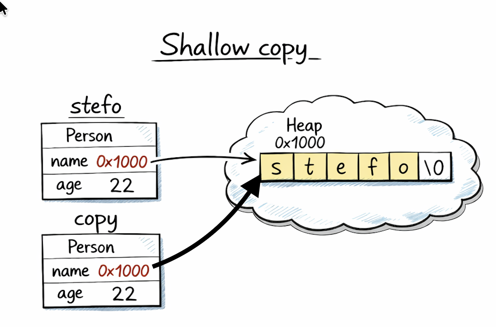
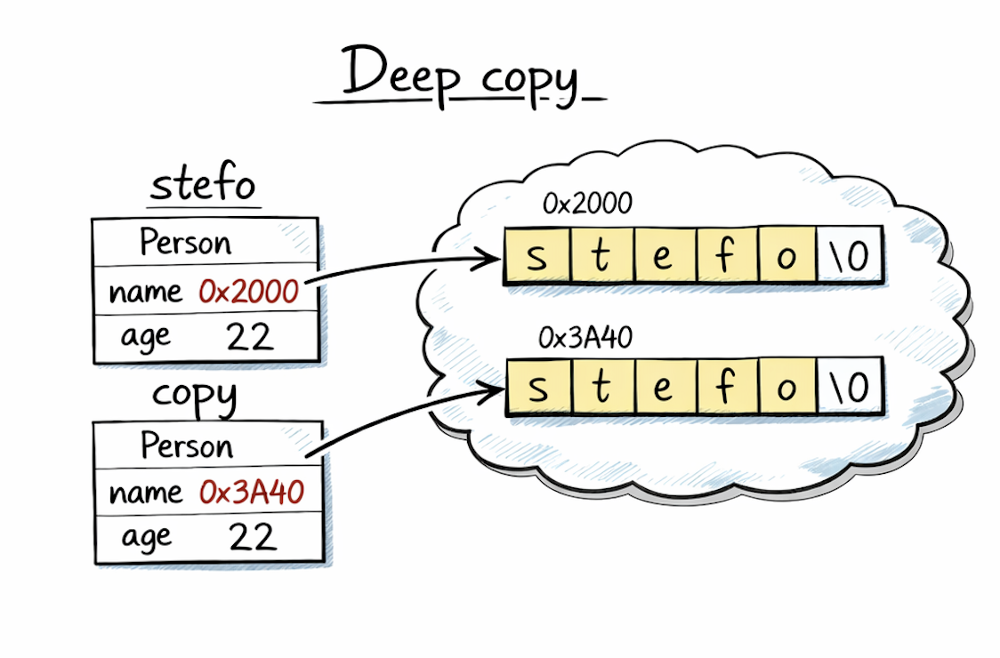

# 05. Копиращ конструктор и `operator=`. Deep copy и shallow copy. Rule of 3 (голямата четворка). Return-value optimization.

## [Single Responsibility (SOLID)](https://github.com/StefanShivarov/oop-course-fmi-2026/tree/main/SOLID%20Principles/01_Single_Responsibility)
## [Singleton design pattern](https://github.com/StefanShivarov/oop-course-fmi-2026/tree/main/Seminar%2005/Singleton_design_pattern)

## Копиращ конструктор и `operator=`.

Заедно с конструктора по подразбиране и деструктора, за всеки клас в C++ са важни и следните специални член-функции:

- **Копиращ конструктор** — конструктор, който приема обект (константа референция) от същия клас и създава **нов обект** като негово копие

- **Оператор=** (assignment operator) — функция/оператор, който приема обект (константна референция) от същия клас и **променя вече съществуващ обект**, така че да стане копие на другия

**При липса на дефиниран копиращ конструктор и/или оператор=, компилаторът автоматично генерира такива.**

> **Важно:**  
> Копиращият конструктор **създава нов обект** (initialization).  
> Оператор= **присвоява стойност на вече съществуващ обект** (assignment).

---

### Инициализация
Имаме **създаване на нов обект**.

```cpp
Person p1("Stefo");
Person p2(p1);      // copy constructor
Person p3 = p1;     // пак copy constructor
```

Въпреки че `Person p3 = p1;` съдържа `=`, това **не е** извикване на `operator=`.  
Тук обектът `p3` тепърва се създава, затова се извиква **копиращият конструктор**.

---

### Присвояване
Имаме **вече съществуващ обект**, който променяме.

```cpp
Person p1("Stefo");
Person p2; // default constructor

p2 = p1;   // operator=
```

Тук `p2` вече съществува, следователно това е **assignment**, тоест се извиква **оператор=**.

---

## Пример

```cpp
#include <iostream>

struct Example {
    Example() {
        std::cout << "Example()" << std::endl;
    }

    Example(const Example& other) {
        std::cout << "Copy constructor of Example" << std::endl;
    }

    Example& operator=(const Example& other) {
        std::cout << "operator= of Example" << std::endl;
        return *this;
    }

    ~Example() {
        std::cout << "~Example()" << std::endl;
    }
};

void f(Example object) {
    // object is a copy
}

void g(Example& object) {
    // no copy
}

int main() {
    Example e;          // Default constructor

    Example e2(e);      // Copy constructor
    Example e3(e2);     // Copy constructor

    e2 = e3;            // operator=
    e3 = e;             // operator=

    Example newExample = e; // Copy constructor

    f(e);               // Copy constructor
    g(e);               // nothing - passed by reference

    Example* ptr = new Example(); // Default constructor

    delete ptr;         // Destructor
}
```

---

### Кога се извиква копиращият конструктор

Копиращият конструктор се извиква, когато трябва да се **създаде нов обект като копие на друг**.

Най-често това става в следните ситуации:

#### 1. При инициализация с друг обект
```cpp
Person p1("Stefo");
Person p2(p1);
Person p3 = p1;
```

#### 2. При подаване по стойност
```cpp
void printPerson(Person p) { ... }

Person p("Stefo");
printPerson(p);   // p се създава като копие
```

---

### Кога се извиква operator=

Оператор= се извиква, когато имаме **два вече съществуващи обекта** и искаме единият да стане копие на другия.

```cpp
Person a("Stefo");
Person b; // default constructor

b = a;  // operator=
```

---

## Защо и кога дефинираме copy constructor и operator=

Най-честата причина е работа с **динамична памет** или друг ресурс.

Тук идват понятията:

- **Shallow copy**
- **Deep copy**

---

## Shallow copy

При **shallow copy** се копират директно стойностите на член-данните.

Ако имаме указател, ще се копира **адресът**, а не съдържанието, към което сочи.

### Пример

```cpp
struct Person {
    char* name;
    int age;
};
```

Ако компилаторът генерира copy constructor по подразбиране, той ще направи нещо еквивалентно на:

```cpp
newObject.name = oldObject.name;
newObject.age = oldObject.age;
```

Тоест и двата обекта ще сочат към **една и съща динамична памет** за `name`.

---

### Проблеми при shallow copy

Ако два обекта сочат към една и съща динамична памет, възникват сериозни проблеми:

- #### Double delete
    И двата деструктора ще се опитат да изтрият една и съща памет.

- #### Неочаквано споделяне на състояние
    Промяна през единия обект променя и “копието”.

- #### Висящи указатели
    След като единият обект освободи паметта, другият остава с невалиден указател.

---


#### Пример с проблем при липсващи дефиниции на копиращи операции:

```cpp
#include <cstring>

struct Person {
    char* name;
    int age;

    Person(const char* name, int age) {
        this->age = age;
        this->name = new char[std::strlen(name) + 1];
        std::strcpy(this->name, name);
    }

    ~Person() {
        delete[] name;
    }
};
```

#### Проблемен сценарий:

```cpp
int main() {
    Person p1("Stefo", 22);
    Person p2 = p1;   // compiler-generated copy constructor

} // и p1, и p2 ще извикат delete[] върху един и същи name
```

Това е класически пример защо **не можем да разчитаме на генерираните от компилатора копиращи операции**, когато класът управлява ресурс.

## Deep copy

При **deep copy** създаваме **нова собствена памет** за новия обект и копираме съдържанието вътре.

Тоест за примера отгоре:
- не копираме само адреса
- заделяме отделна динамична памет, в която копираме самия низ, към който сочи `name`

---




### Какво прави компилаторът по подразбиране

Ако не дефинираме copy constructor и operator=, компилаторът генерира такива, които **копират член-данните едно по едно**.

Тоест:

- за `int`, `double`, `bool`, `char` и др. това обикновено е напълно ОК
- за указатели това копира **само адреса**
- за член-данни, които са обекти, се използват техните собствени копиращи операции

---

### Кога default копиране е достатъчно

Default копиране е напълно достатъчно, когато:
- класът съдържа само стойностни типове
- или всички негови член-данни се копират коректно сами

Пример:

```cpp
struct Point {
    int x;
    int y;
};
```

Тук генерираните от компилатора copy constructor и operator= са напълно достатъчни.

---

## Кога трябва да дефинираме собствени копиращи операции

Най-често:
- когато класът управлява **динамична памет**
- когато класът управлява **файл**
- когато класът пази **socket / handle / mutex / resource**
- когато искаме специална логика при копиране

---

## Как се дефинира правилен copy constructor

Когато имаме динамична памет, в повечето случаи искаме копиращият конструктор да направи **deep copy**.

#### Пример:

```cpp
#include <cstring>

struct Person {
    char* name;
    int age;

    Person(const char* name, int age) {
        this->age = age;
        this->name = new char[std::strlen(name) + 1];
        std::strcpy(this->name, name);
    }

    Person(const Person& other) {
        age = other.age;
        name = new char[std::strlen(other.name) + 1];
        std::strcpy(name, other.name);
    }

    ~Person() {
        delete[] name;
    }
};
```

Тук:
- заделяме нова памет
- копираме съдържанието
- двата обекта вече имат независими ресурси, които на практика са еднакви, но на отделни места в паметта

---

## Как се дефинира правилен operator=

Оператор= също трябва да направи **deep copy**, но има една важна разлика:

- при copy constructor създаваме нов обект и няма нужда да освобождаваме, понеже все още няма заделени външни ресурси
- при operator= вече имаме стар заделен ресурс в текущия обект, който трябва да бъде обработен правилно

Тоест обикновено:
1. освобождаваме стария ресурс
2. копираме новите данни

#### Пример:

```cpp
#include <cstring>

struct Person {
    char* name;
    int age;

    Person(const char* name, int age) {
        this->age = age;
        this->name = new char[std::strlen(name) + 1];
        std::strcpy(this->name, name);
    }

    Person(const Person& other) {
        // deep copy
        age = other.age;
        name = new char[std::strlen(other.name) + 1];
        std::strcpy(name, other.name);
    }

    Person& operator=(const Person& other) {
        if (this != &other) {
            // free allocated dynamic memory
            delete[] name; 

            // deep copy
            age = other.age;
            name = new char[std::strlen(other.name) + 1];
            std::strcpy(name, other.name);
            
        }
        return *this;
    }

    ~Person() {
        delete[] name;
    }
};
```

---

### Защо проверяваме `if (this != &other)`

За да защитим случая на **self-assignment**:

```cpp
Person stefcho("Stefcho", 22);
stefcho = stefcho;
```

Без тази проверка ще:
- изтрием собствените си данни
- опитаме да копираме от вече освободена памет

---

### Полезна организация: `copyFrom()` и `free()`

Често логиката на копиране и освобождаване се изнася в помощни функции.

## Пример

```cpp
#include <cstring>

struct Person {
private:
    char* name;
    int age;

    void copyFrom(const Person& other) {
        age = other.age;
        name = new char[std::strlen(other.name) + 1];
        std::strcpy(name, other.name);
    }

    void free() {
        delete[] name;
    }

public:
    Person(const char* name, int age) {
        this->age = age;
        this->name = new char[std::strlen(name) + 1];
        std::strcpy(this->name, name);
    }

    Person(const Person& other) {
        copyFrom(other);
    }

    Person& operator=(const Person& other) {
        if (this != &other) {
            free();
            copyFrom(other);
        }
        return *this;
    }

    ~Person() {
        free();
    }
};
```

---

## Забележка за `copyFrom()`

Понякога е удобно `copyFrom()` да обработва **само динамичната памет**, а останалите член-данни да се копират експлицитно там, където е нужно.

_Причината за това е, че в копиращия конструктор е по-хубаво да се извикат копиращите конструктори на член-данните директно от member-initializer листа, вместо с оператор=, понеже така ще им се извикат само копиращите конструктори, а не default constructor + operator=._

- copy constructor работи в етап на **създаване** и първоначално извиква конструктор на член-данните преди да влезне в тялото си
- operator= работи върху **вече съществуващ обект** и не вика нищо преди тялото си

Например можем да организираме кода и така:

```cpp
void copyDynamicData(const Person& other) {
    name = new char[std::strlen(other.name) + 1];
    std::strcpy(name, other.name);
}

Person(const Person& other)
    : age(other.age) {
    copyDynamicData(other);
}

Person& operator=(const Person& other) {
    if (this != &other) {
        free();
        age = other.age;
        copyDynamicData(other);
    }
    return *this;
}
```

Така става по-ясно кои членове са “обикновени” и кои изискват специална грижа.

---

### Защо initializer list е по-добър в copy constructor

При copy constructor член-данните трябва да бъдат **инициализирани**, не първо създадени по подразбиране и после присвоени.

Когато пишем:

```cpp
Person(const Person& other)
    : address(other.address) {
    name = new char[std::strlen(other.name) + 1];
    std::strcpy(name, other.name);
}
```

се случва:
- `address` се създава директно чрез неговия copy constructor

Докато при:

```cpp
Person(const Person& other) {
    address = other.address;
}
```

се случва:
1. `address` първо се създава с default constructor
2. после се вика `operator=`

Това е:
- по-неефективно
- понякога дори невъзможно, ако членът няма default constructor
- концептуално не е правилният начин за copy constructor

> **Извод:**  
> В copy constructor обикновено копираме член-данните в **initializer list**. 

---

### Аналогично за operator=

При `operator=` член-данните вече съществуват, следователно там е нормално да използваме техния `operator=`.

```cpp
struct Person {
    Address address;
    char* name;

    Person& operator=(const Person& other) {
        if (this != &other) {
            address = other.address;

            delete[] name;
            name = new char[std::strlen(other.name) + 1];
            std::strcpy(name, other.name);
        }
        return *this;
    }
};
```

---

## Концептуална разлика между copy constructor и operator=

### Copy constructor
- създава нов обект
- трябва да построи обекта в коректно състояние
- прави deep copy на ресурсите

### operator=
- обектът вече съществува
- може вече да притежава ресурс
- трябва първо да се справи със старото състояние
- после да копира новото

С други думи:

- **copy constructor**: “създай ми нов независим обект като копие”
- **operator=**: “изхвърли старото съдържание на този обект и го замени с копие на другия”

---

## Rule of Three / “голямата четворка”

Когато един клас управлява ресурс ръчно (например динамична памет чрез `new[]` / `delete[]`), много често се налага да дефинираме заедно следните функции:

- деструктор
- копиращ конструктор
- оператор=

Това е известно като **Rule of Three**.

Идеята е следната:
- щом класът има нужда от собствен деструктор, значи вероятно управлява ресурс
- тогава почти сигурно default копиращият конструктор и default оператор= няма да са достатъчни
- затова трябва да дефинираме и трите

В много учебни контексти се говори и за **„голямата четворка“**:
- constructor
- copy constructor
- operator=
- destructor

В този курс често е удобно да мислим за тях заедно, защото при класове с динамична памет именно те описват целия жизнен цикъл на обекта:
- как се създава
- как се копира при създаване
- как се присвоява върху вече съществуващ обект
- как се унищожава

---

## RVO и NRVO

Когато връщаме обекти по стойност, интуитивно очакваме да се извиква copy constructor. На практика често това не се случва заради оптимизации.

### RVO — Return Value Optimization

Компилаторът конструира директно резултата на правилното място, без излишно копиране.

```cpp
struct Example {
    Example() {
        std::cout << "Example()" << std::endl;
    }

    Example(const Example& other) {
        std::cout << "Copy constructor of Example" << std::endl;
    }

    ~Example() {
        std::cout << "~Example()" << std::endl;
    }
};

Example create() {
    return Example();
}

int main() {
    Example e = create();
}
```

---

### NRVO — Named Return Value Optimization

Подобна идея, но при връщане на **именуван локален обект**.

```cpp
Example create() {
    Example temp;
    return temp;   // често NRVO
}
```

И тук в много случаи компилаторът елиминира копирането.

---

## `= delete` в C++

В C++ можем изрично да забраним използването на дадена специална член-функция или на произволна функция, като я маркираме с `= delete`.

Това казва на компилатора:

> "Тази функция съществува като декларация, но не позволяваме да бъде извиквана."

Ако някой опита да я използва, програмата няма да се компилира.


```cpp
class Example {
public:
    Example(const Example&) = delete;
    Example& operator=(const Example&) = delete;
};
```

Тук казваме, че:
- обекти от `Example` **не могат да се копират**
- не може да се извика нито копиращ конструктор, нито `operator=`

---

### Какво точно прави `= delete`

`= delete`:
- забранява извикването на дадена функция
- кара компилатора да даде **compile-time error**, ако се опитаме да я използваме
- прави намерението ни ясно и експлицитно

Това е по-добре от това просто да оставим функцията недефинирана, защото:
- грешката се хваща по-рано
- съобщението от компилатора е по-ясно
- кодът ясно показва, че операцията е забранена по дизайн

---

### Кога използваме `= delete`

#### 1. Когато искаме класът да е non-copyable

Това е най-честият случай.

```cpp
class UniqueResource {
public:
    UniqueResource(const UniqueResource&) = delete;
    UniqueResource& operator=(const UniqueResource&) = delete;
};
```

Така изразяваме, че обектите имат **уникална собственост** и не трябва да се копират.

---

#### 2. Когато искаме да забраним извикване на функция с определен тип параметър

`= delete` не е само за специални член-функции.

Можем да забраним и обикновени overload-и.

### Пример

```cpp
void print(int x) {
    std::cout << x << std::endl;
}

void print(double) = delete;
```

Сега:

```cpp
print(5);    // OK
print(3.14); // error
```

Това може да се използва, когато искаме да ограничим кои типове са позволени.

---

### `= delete` и Rule of Three / Rule of Five

Ако един клас не трябва да се копира, обикновено изрично забраняваме:

```cpp
class X {
public:
    X(const X&) = delete;
    X& operator=(const X&) = delete;
};
```

Тоест вместо да имплементираме deep copy, казваме:
- този тип **няма copy semantics**
- обектите му не могат да се копират

Това е напълно валиден дизайн.

С други думи, при класове с ресурси имаме две основни възможности:
- или дефинираме правилно копиране
- или изрично го забраняваме с `= delete`

---

### Разлика между `private` copy constructor (стар стил) и `= delete`

Преди C++11 често се е писало нещо такова:

```cpp
class Example {
private:
    Example(const Example&);
    Example& operator=(const Example&);
};
```

Така копирането е било скрито и недостъпно.

След C++11 по-добрият и стандартен начин е:

```cpp
class Example {
public:
    Example(const Example&) = delete;
    Example& operator=(const Example&) = delete;
};
```

Защо е по-добре?
- по-ясно е
- дава по-добри грешки от компилатора
- изразява директно намерението

---

Пример за това кога бихме използвали забраняване на копиращи операции е **[Singleton Design Pattern](https://github.com/StefanShivarov/oop-course-fmi-2026/tree/main/Seminar%2005/Singleton_design_pattern)**.
